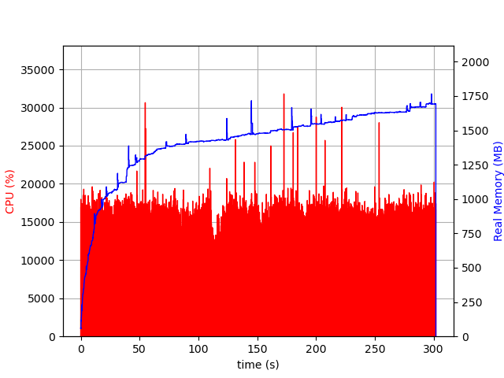

# WebP Bench

This is a helper repo that tests different versions of WebP Server Go's performance and RAM usage, for results please visit https://docs.webp.sh/benchmark/.

## Prepare

Install requirements, since this test is done with `jemalloc`, you need to install it first.

```bash
apt install libvips-dev libjemalloc2 -y
pip3 install psrecord
```

Create a directory and clone the following repos:

* https://github.com/webp-sh/webp_server_go
* https://github.com/webp-sh/webp_bench

Now your directory should look like this:

```bash
[Nova@WebP bench]$ ls -l
total 8
drwxr-xr-x.  4 Nova Nova 4096 Jul 24 15:58 webp_bench
drwxr-xr-x. 12 Nova Nova 4096 Jul 24 15:58 webp_server_go
```

Download example image set and place inside `webp_bench` directory:

```
cd webp_bench/pics && wget https://archive.org/download/imgur_VCnYv/imgur_VCnYv.zip
unzip imgur_VCnYv.zip && rm -f imgur_VCnYv.zip
```

Now it's ready to bench, make sure you `cd` back inside `webp_bench` directory.

> If you're not using Ubuntu 22.04 for testing, make sure to change line 19 of `bench.sh` as jemalloc's path may be different.
>
> For example, in fedora it's `/usr/lib64/libjemalloc.so.2`

## Test on single version

For example you want to test on 0.8.0

```bash
./bench.sh 0.8.0
```

Example output at `benchmark/0.8.0.png`



Example output at `benchmark/data.txt`

```
0.8.0 709       00:49
```

> version RAM(MB) Time(MM:SS)


## Test on all versions

```
./bench_all.sh
```